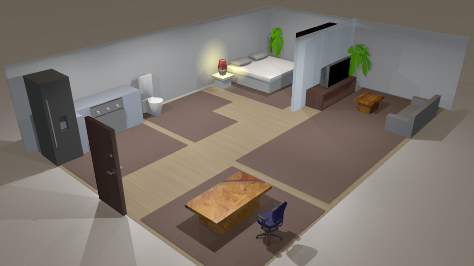

### NOTE: This project requires Blender 2.7 or less
Newer versions of Blender removed the Blender Game Engine (BGE) which is required for OpenSHS.

# OpenSHS
Open Smart Home Simulator


# Demo Video
[](https://www.youtube.com/watch?v=lx9Ziqi162I)

# Installing OpenSHS on Windows Video
[](https://www.youtube.com/watch?v=GHHsXPvaAnY)

# Quick Start
Ensure you have blender installed. To start a simulation of our demo:
Ensure you have installed python3 and modules click and indexed.py (see requirements.txt file).

```
cd app/
python openshs start -c morning
```

This will starts a blender session with the morning context simulation. Start the simulation by clicking <kbd>p</kbd>.
All the interactoins will be captured and saved into `app/temp`.

After doing mulitple simulations for each context (weekday morning, weekday evenings, weekend morning, weekend evenings), aggregate the final dataset by:
```
python openshs aggregate -d 30 -sd 2016-02-01 -tm 10
```

This will generate 30 days worth of data starting from 2016-02-01 and with a time margin of 10 minutes. The final dataset will be placed in `app/datasets`

# Citations
## The accompanying research paper
[OpenSHS: Open Smart Home Simulator](http://www.mdpi.com/1424-8220/17/5/1003/htm) published in [Sensors Journal](http://www.mdpi.com/journal/sensors)

## The code:
[](https://zenodo.org/badge/latestdoi/73079640)
